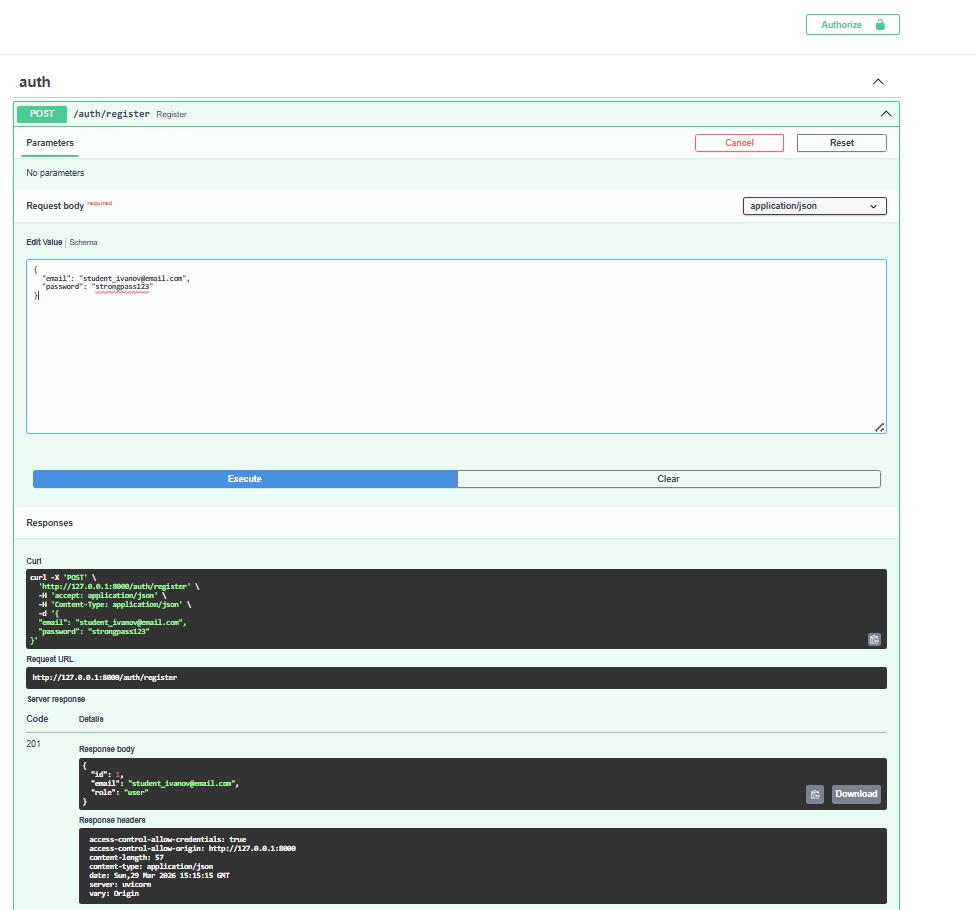
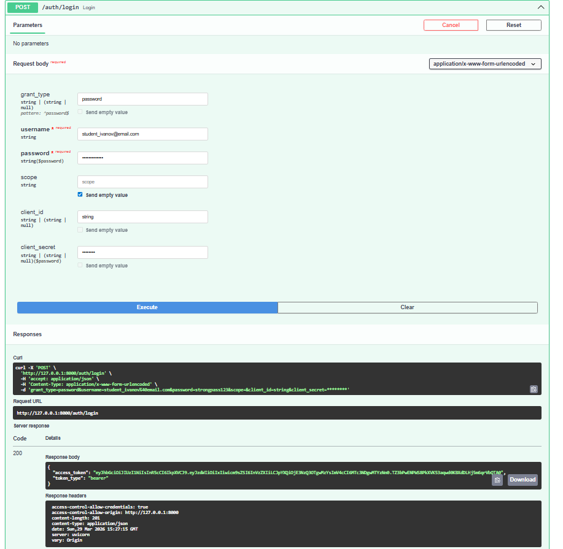
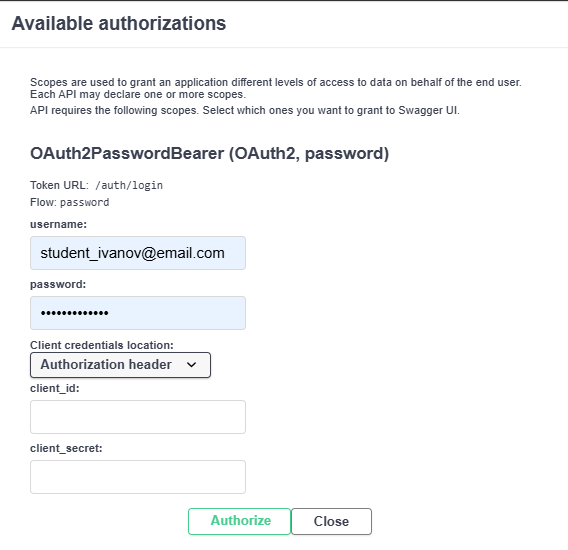
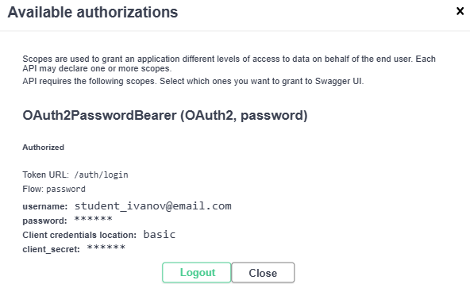
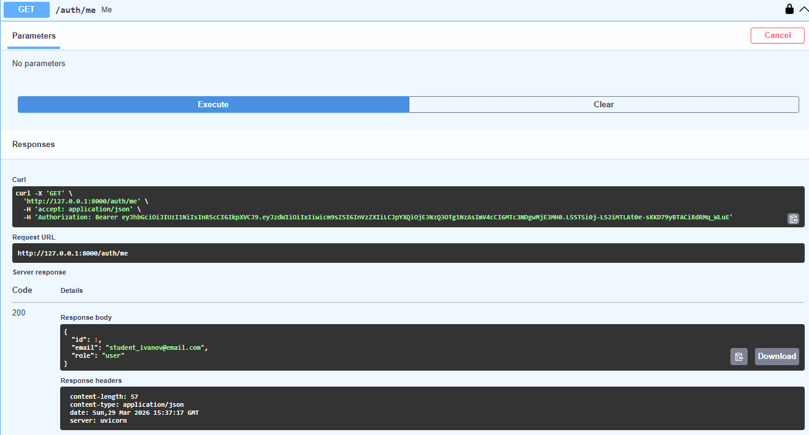
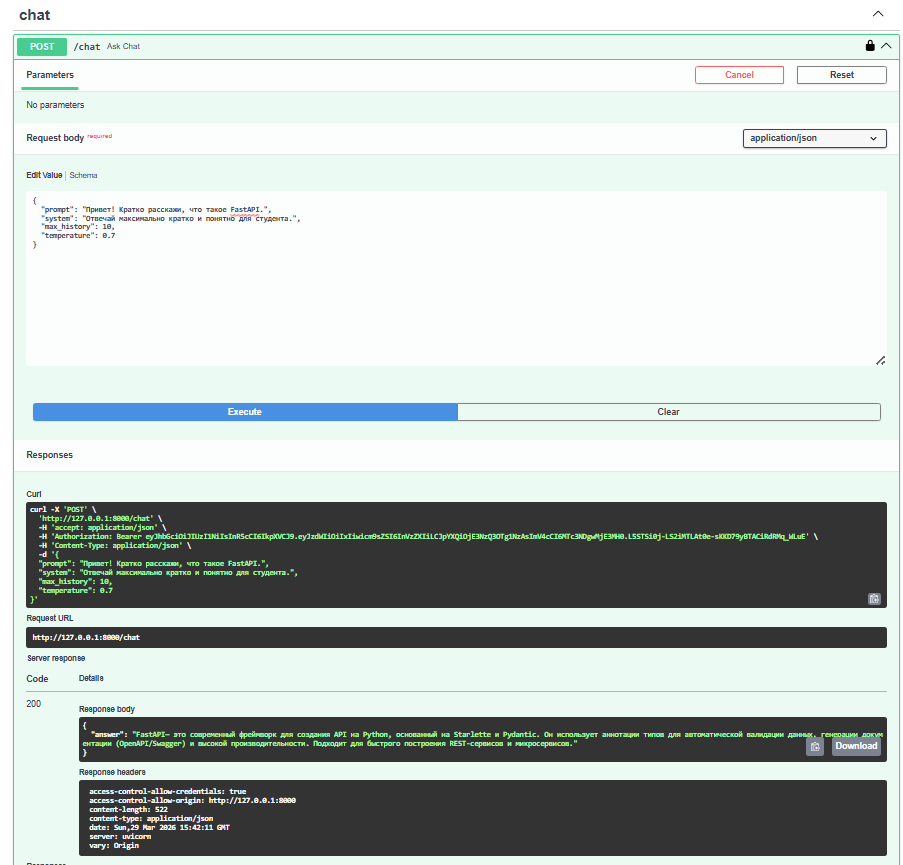
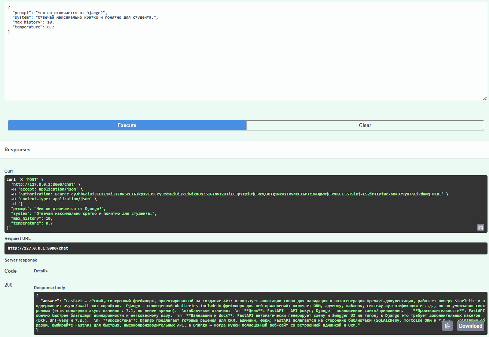
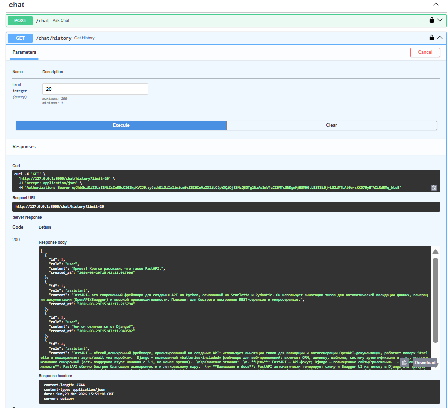
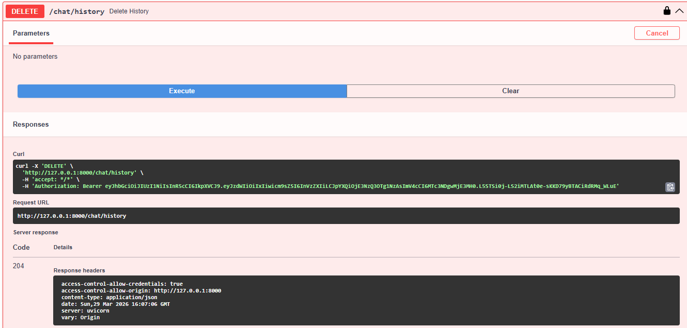
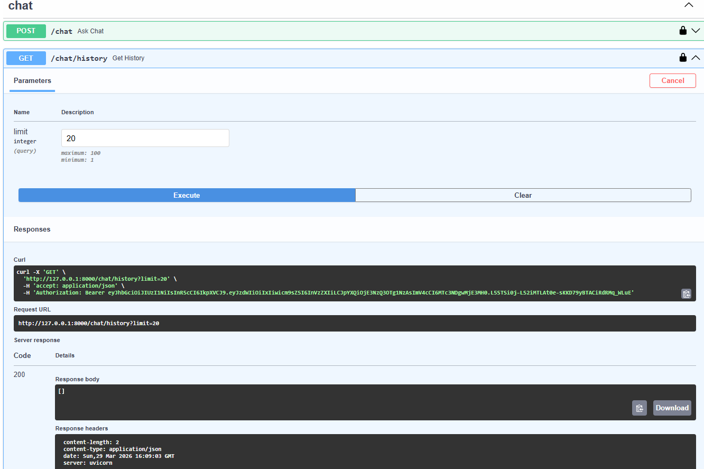

# Проект выполнил студент группы М25-555 Иванов Александр Александрович (М255985)

# llm-p

Учебный FastAPI-сервис с JWT-аутентификацией, SQLite и проксированием запросов к OpenRouter.

## Запуск

```powershell
uv run uvicorn app.main:app --reload --host 0.0.0.0 --port 8000
```

Swagger UI доступен по адресу [http://127.0.0.1:8000/docs](http://127.0.0.1:8000/docs).

## Что реализовано

- Регистрация, логин и получение профиля через JWT
- История чата в SQLite через SQLAlchemy Async
- Интеграция с OpenRouter через отдельный сервисный слой
- Разделение на API, usecases, repositories, db и services

## Переменные окружения

Скопируйте [`.env.example`](./.env.example) в [`.env`](./.env) и вставьте свой `OPENROUTER_API_KEY`.

В проекте для тестирования используется бесплатная модель OpenRouter:
- `nvidia/nemotron-3-super-120b-a12b:free`

## Демонстрация работы

Во всех примерах регистрации использован email в формате `student_surname@email.com`.

### 1. Регистрация пользователя

[](./register-user.png)

### 2. Логин и получение JWT

[](./login-jwt.png)

### 3. Авторизация через Swagger

Авторизация выполнена через встроенный механизм Swagger `OAuth2PasswordBearer`.
В форму `Authorize` были введены email и пароль пользователя.

[](./swagger-authorize-form.png)

[](./swagger-authorize-confirmed.png)

После успешной авторизации защищенные эндпоинты стали доступны по JWT.

[](./auth-check.png)

### 4. Вызов `POST /chat`

Первый вызов:

[](./chat-post-1.png)

Второй вызов:

[](./chat-post-2.png)

### 5. Получение истории через `GET /chat/history`

[](./chat-history-get.png)

### 6. Удаление истории через `DELETE /chat/history`

Удаление истории:

[](./chat-history-delete.png)

Проверка очистки истории:

[](./chat-history-delete-check.png)
